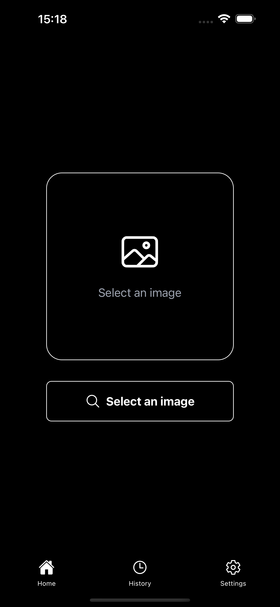
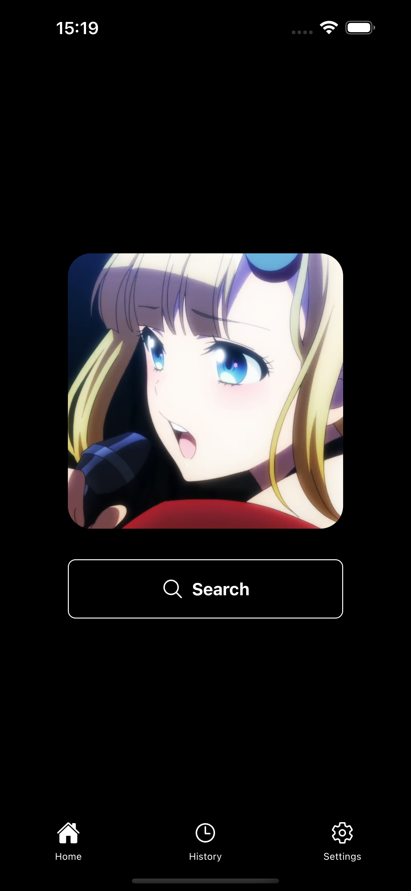
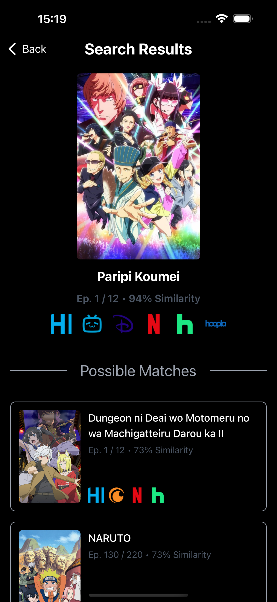
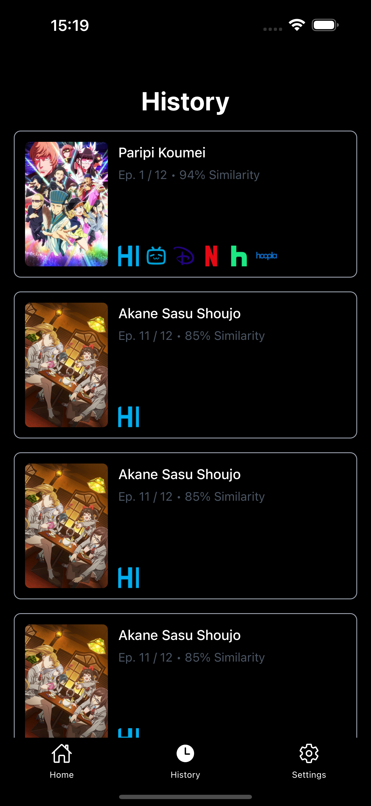
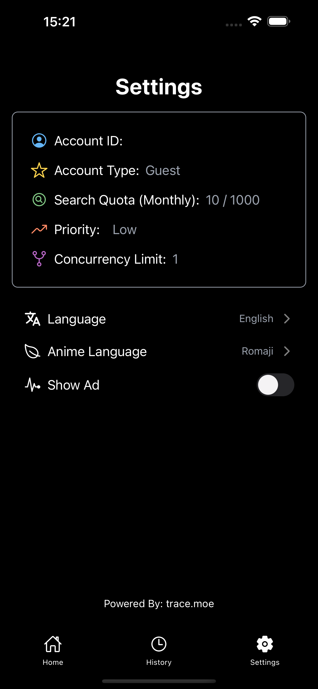
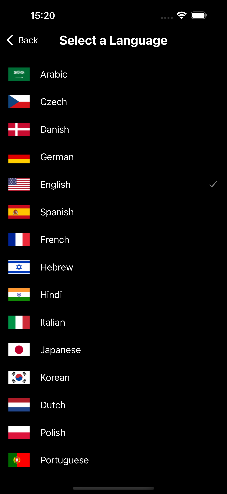
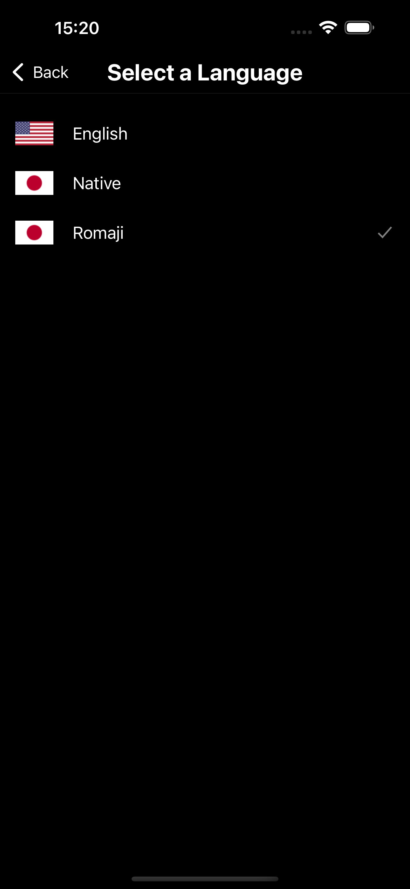

<h1 align="center"><b>wAnime</b>

    
   <!-- -->
    

</h1>

<h4 align="center">Unofficial version of Trace.Moe on mobile device.</h4>

  <!--   -->
    
    

## About

Ever seen an anime scene and wondered which series it's from? Find out instantly with this unofficial Trace.moe app!

Just upload an image or screenshot, and the app will identify the anime and episode. It's that simple!

## Screenshots

    
    
    
    
    
    
    

## Features

- Instant recognition: Identify anime from any image in seconds.
- Detailed results: Get the anime name and episode.
- Search history: Save and revisit your previous searches.
- Easy to use: User-friendly interface for a quick and seamless experience.

## Permissions

- Storage (`READ_MEDIA_IMAGES`, `READ_MEDIA_VIDEO`, `WRITE_EXTERNAL_STORAGE`) to read and scan image

## License

wAnime is Free Software: You can use, study share and improve it at your
will. Specifically you can redistribute and/or modify it under the terms of the
[GNU General Public License](https://www.gnu.org/licenses/gpl.html) as
published by the Free Software Foundation, either version 3 of the License, or
(at your option) any later version.
